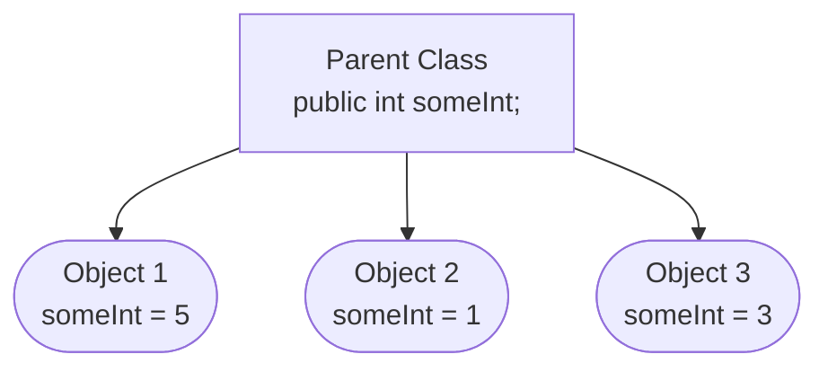
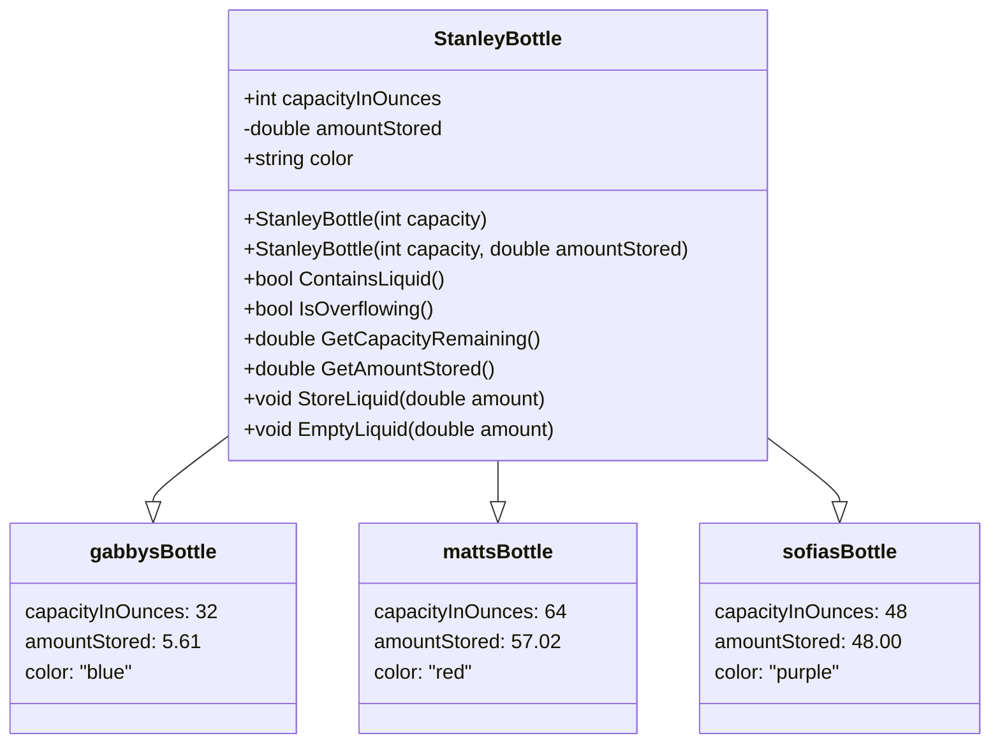

Objects are constructs that are used for representing data in unified logical blocks. They are created using classes as ***blueprints*** for how an object should behave. Each object contains a collection of variables called ***fields***, which are used to represent the ***state*** of that object. Actions can be performed on objects, using ***[[Methods]]***.

## Classes

Classes allow developers to create user-defined types, and maintain objects with custom functionality and data storage. They describe how an object should be created, what that object might store, and any actions that can be performed using the object.

Classes can be considered 'blueprints' for creating and operating objects, and do not directly impact any logic executing outside of them.

### Methods

Classes describe actions that can be performed using [[Methods]]. These methods can calculate their results using data stored in the class's ***fields***, or even manipulate that data.

### Fields

Classes can specify ***fields*** to allow for permanent data storage during the lifetime of the object created using a class. To create a field, simply declare a variable directly in the scope of a class:

```cs
public class SomeClass {
	
	// this declares a field 'someStringField' inside 'SomeClass'
	public string someStringField; 
	
	// the 'public' keyword used here is an access specifier.
}
```

Fields are a kind of variable that allow for access outside the scope that a variable would normally be accessible. Fields are often referred to as ***attributes*** or ***global variables***, while variables created in methods are referred to as ***local variables***.

Fields are able to be accessed and manipulated outside of the scope of a method, but within the same class. This behavior is often used for sharing internal data between methods, or for persisting data that describes the object itself. 

Here's an example of sharing data between methods:

```cs
class TheClass {
	private int theVariable = 0;
	
	public void Method1() {
		theVariable = 5;
	}

	public bool Method2() {
		return theVariable > 3;
	}
}
```

```cs
var myObj = new TheClass();

Console.WriteLine(myObj.Method2()); //> false
myObj.Method1(); // this will update the variable
Console.WriteLine(myObj.Method2()); //> true
```

In the above example, the result of `Method2` will change depending on the value stored in `theVariable`. This value can be updated inside of `Method1`, allowing `Method1` to change data being consumed by another method.

When there is a field that has the same name as a *local variable*, you can specify the field using the `this` keyword. Below is an example of how this behavior works in code:

```cs
class TheClass {
	private bool myBool; // this is our field
	
	public void TheMethod() {
		var myBool = false; // this is our local variable
		
		// this assigns the field to the value of the local variable.
		this.myBool = myBool; 
		
		// myBool = myBool; // this would just assign the local variable to itself.
	}
}
```

#### Access Specifiers

[[Methods]] and fields utilize access specifiers to describe what is allowed to access them. There are two main access specifiers that you should know:

- `public` - Allows access from external classes, regardless of where the call is made
- `private` - Only allows access from within the class it's specified in

There are some [additional access specifiers](https://learn.microsoft.com/en-us/dotnet/csharp/programming-guide/classes-and-structs/access-modifiers) that won't be relevant until we cover [[Future Lesson - Inheritance|inheritance]] in a future lesson.
### The 'Dot' Operator

The `.` operator allows for direct access to methods, properties, and fields that are contained in an object.

```cs
var obj = new SomeClass(); // this would create an object from SomeClass

// this would directly access the value of someField stored in the object
var someValue = obj.someField;

// this would call the code described in 'someMethod' and run it
// the result will be returned, and stored in 'someOtherValue'
var someOtherValue = obj.someMethod(someParameter); 
```

### Instances of Classes

The objects created from classes are called *instances* of the class, which each operate independently.

An object *must* be created from a class using the `new` keyword, using the format below:

```cs
var yourVariable = new YourClassName(/* constructor args go here, if needed */);
```

Each object is an *instance* of the class it was created from. This means that the object has all properties, fields, and methods available to it that are described in the class. Objects also have their own concept of *state*, which allows objects to maintain different values for fields described in their parent classes.



In the above diagram, a parent class declares a field `someInt`. This field acts as a way to store int data in each object created from the parent class. Each instance of `someInt` stores data separately, and changing the value stored will not affect any other objects created from the parent class.

### Constructors

Constructors are a special kind of [[Methods|method]] that gets called whenever a new instance of a class is created. Constructors are different from methods because they do not return anything, and can only be executed once per object.

A method must meet the following requirements to be considered a constructor:
- It must have the same name as the class it's in
- It must have no return type

Here is an example of a constructor for a class named `SomeClass`:

```cs
class SomeClass {
	public SomeClass() {
		// the constructor body would go here
		Console.WriteLine("This is the Constructor");
	}
}
```

Constructors will only be executed whenever an instance of the class is created. Using the above example, we can call the constructor whenever an object is created:

```cs
var obj1 = new SomeClass();
var obj2 = new SomeClass();
new SomeClass(); // we don't even need to save the object value to call the constructor

// the above code would print this:
//> This is the Constructor
//> This is the Constructor
//> This is the Constructor
```

## Example Class

Here is an example class that combines the concepts covered in this page. It represents data that could be used to describe a Stanley bottle, and provides some methods to the user for manipulating this data.

```csharp
public class StanleyBottle {
	public readonly int capacityInOunces;
	private double amountStored;
	public readonly string color;

	// this is a constructor for creating instances of the StanleyBottle class
	public StanleyBottle(string color, int capacity) {
		// the parameter 'color' and the field 'color' have the same name,
		// so we need to specify which value is which using the 'this' keyword
		this.color = color; 
		
		// because the parameter and values have a different name,
		// we don't need to use the 'this' keyword here
		capcityInOunces = capacity; 

		// because we don't have a value for amountStored, we will default this to 0
		amountStored = 0;
	}

	// this is an overload of the StanleyBottle constructor
	public StanleyBottle(string color, int capacity, double amountStored) {
		this.color = color;
		this.amountStored = amountStored;
		
		// we don't need the 'this' keyword here, 
		// but we can still use it if we want to
		this.capcityInOunces = capacity;
	}

	// this is a simple 'getter' method. its purpose is to access the value stored in
	// a private variable and return it directly. because we do not provide direct
	// access to the private variable, code outside of our class will be able to read
	// the value, but not be able to modify it.
	public double GetAmountStored() {
		return amountStored;
	}

	// the two below methods change the value of 'amountStored', which will manipulate 
	// the state of the object. some methods can change
	public void StoreLiquid(double amount) {
		return amountStored += amount;
	}
	
	public void EmptyLiquid(double amount) {
		return amountStored -= amount;
	}
	
	public double GetCapacityRemaining() {
		return capacity - amountStored;
	}

	// this method returns a bool as specified in the method signature
	// the bool returned will be the result of 'amountStored > 0'
	public bool ContainsLiquid() {
		return amountStored > 0;
	}
	
	public bool IsOverflowing() {
		return amountStored > capacity;
	}
}
```


The above class can be mapped to the below UML diagram:




