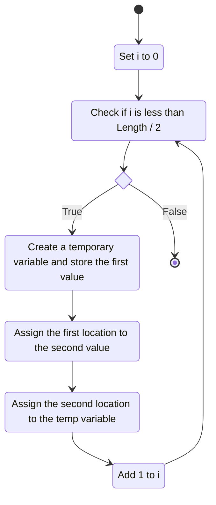
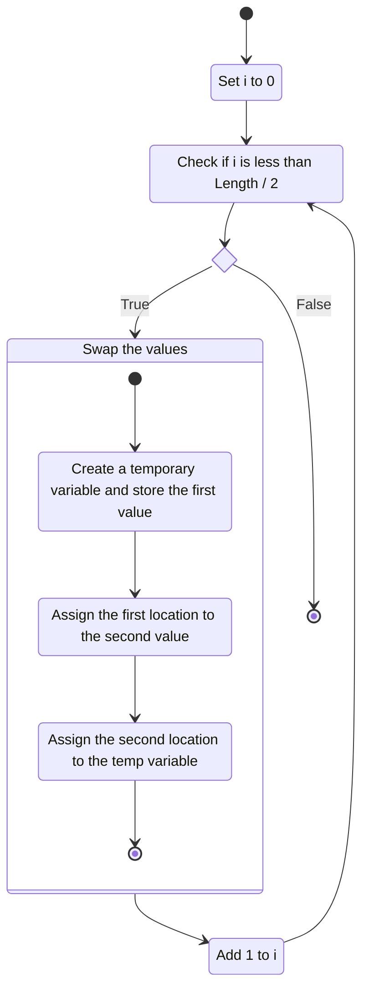
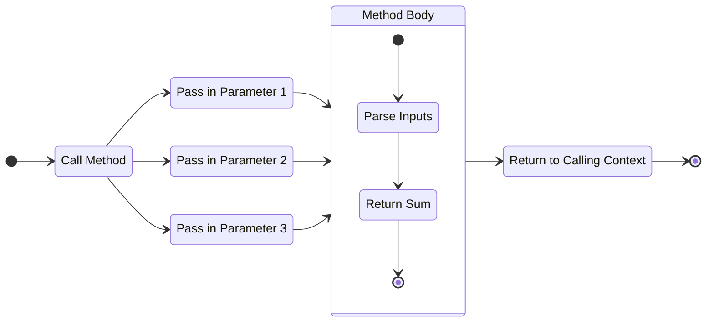

---
aliases:
  - method
---
## Overview

Methods, often referred to as *functions*, are structures that allow for the logical grouping of blocks of code. Their primary purpose is to allow developers to create layers of abstraction around lower-level blocks of logic to allow for better readability and development of higher-order logic.

Let's use the solution for a question from a previous lesson as an example:

```cs
var input = new int[] { 35, 30, 41, 12, 6, 14, 10, 31, 18, 24, 34, 5, 29, 23 };

// Reverse the order of each element in the array.
for (int i = 0; i < input.Length / 2; i++) {
	var temp = input[i];
	input[i] = input[input.Length - i - 1];
	input[input.Length - i - 1] = temp;
}
```

This logic could be represented with the state diagram below:



To simplify the logic, we could group the logic for swapping to variables into its own operation. Doing so would make the diagram look like the below:



This process is called ***abstraction***. It takes small pieces of low-level logic and groups them into higher-order functions that usually make more sense to humans that are trying to understand the big picture.

The process of abstraction is achieved by creating *methods* that perform logic but hide it away from view, allowing for cleaner, more readable code to be written.

When properly abstracted, the code described might look like this:

```cs
var input = new int[] { 35, 30, 41, 12, 6, 14, 10, 31, 18, 24, 34, 5, 29, 23 };

// Reverse the order of each element in the array.
for (int i = 0; i < input.Length / 2; i++) {
	SwapValues(input, i, input.Length - i - 1);
}

// the below code is a Method. continue reading to learn more about Methods
void SwapValues(int[] input, int index1, int index2) {
	var temp = input[index1];
	input[index1] = input[index2];
	input[index2] = temp;
}
```


## Components of a Method

Methods have four components that are required for them to function properly:
- A Name
- Parameters \[Optional\]
- A Return Type
- An Access Specifier

Methods can be written in code using the below format:

```cs
AccessSpecifier ReturnType Name(ParamType1 ParamName1, ParamType2 ParamName2, ...) {
	// method body goes here
}
```
#### Parameters

Parameters are the 'inputs' for sending data to a method. Each parameter in a method must have a specified type, and a unique name to be valid. Parameters **must** have a type associated with them, and thus cannot use a type of `var`.

Creating a parameter declares a new variable scoped to the method it was created for, and assigns a value to that variable based on whatever value was passed in from wherever the call to the method was made. 

Values passed in to a method are called *arguments*. It's important to note that when an argument is passed in to a method, it will match a parameter based on its position, and not its name.

#### Method Returns

Returning from a method allows you to output a single value to the context that originally called the method. To return in a method, simply use the `return` keyword, followed by the desired return value. Returning from a method will complete the execution of the method, so any statements written inside of the method after a return statement is encountered will not execute.

Return types specify the type of the value that will be returned from the method. This type will be used whenever the method's return value is used to create a variable, so this is a necessary part of writing a functional method.

#### Access Specifiers
  
Methods and fields utilize access specifiers to describe what is allowed to access them. There are two main access specifiers that you should know:

- `public` - Allows access from external classes, regardless of where the call is made
- `private` - Only allows access from within the class it's specified in

There are some [additional access specifiers](https://learn.microsoft.com/en-us/dotnet/csharp/programming-guide/classes-and-structs/access-modifiers) that won't be relevant until we cover [[Future Lesson - Inheritance|inheritance]] in a future lesson.

#### Calling a Method

Methods can be *called*, which executes them in their own context. Once the execution of the logic described is complete, then any returned values will be sent back to wherever the method was called from.

To directly call a method located in the same class as the scope in which you call it from, simply follow the below format:

```cs
MethodName(argument1, argument2, argument3, ...)
```

To call a method that is stored in a different class, you will need direct access to an object created from that class. You can call your target method using the object like so:

```cs
yourObject.MethodName(argument1, argument2, argument3, ...)
```

Calling a method in this way will cause any global variables used by the method to utilize the values maintained in the object's state.

#### Example Method

```cs
public int GetIntSumOfThreeValues(string Input1, string Input2, string Input3) {
	var val1 = int.Parse(Input1);
	var val2 = int.Parse(Input2);
	var val3 = int.Parse(Input3);
	return val1 + val2 + val3;
}
```

The order in which the data will flow in the above example can be represented using the below diagram:


## Method Signatures

Method signatures are what uniquely identify methods from other methods. Each method has a signature when it is created, specified by the properties below:
- The method name
- The parameter types, count, and order

Multiple methods can be created with the same name, or other properties, but they cannot be created with the same signature. This means that methods can be ***overloaded***, which allows for multiple versions of a method to exist and be called using the same name.

## Scope

*Scope* refers to the context in which a variable, method, or other programming construct resides. Whenever a variable, method, or other construct is accessed from within code, it must be available to the scope it is being accessed from.

Variables created inside of methods are *locally scoped*, meaning that they are scoped to the method that they are created in. These kinds of variables are referred to as *local variables*. They are only able to be accessed from within the method, and will be deleted once the method execution is complete. This means that variables created inside of a method cannot be utilized for persistent data storage, and must be treated as temporary storage.