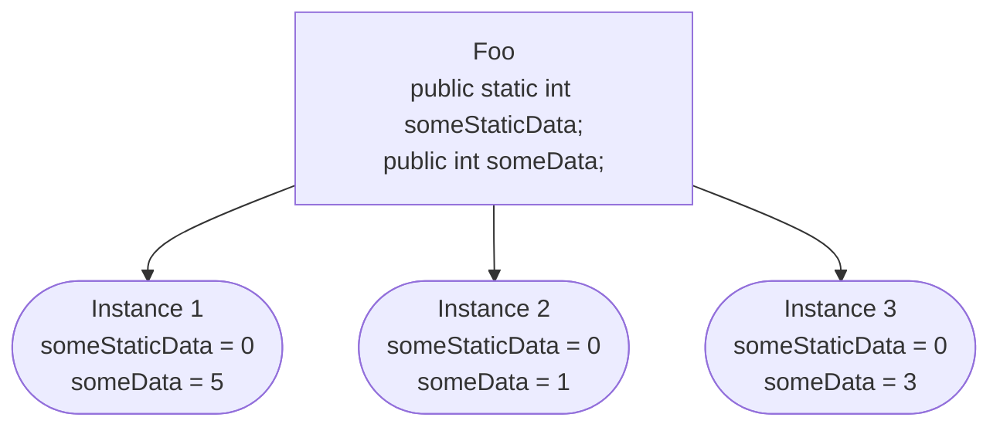
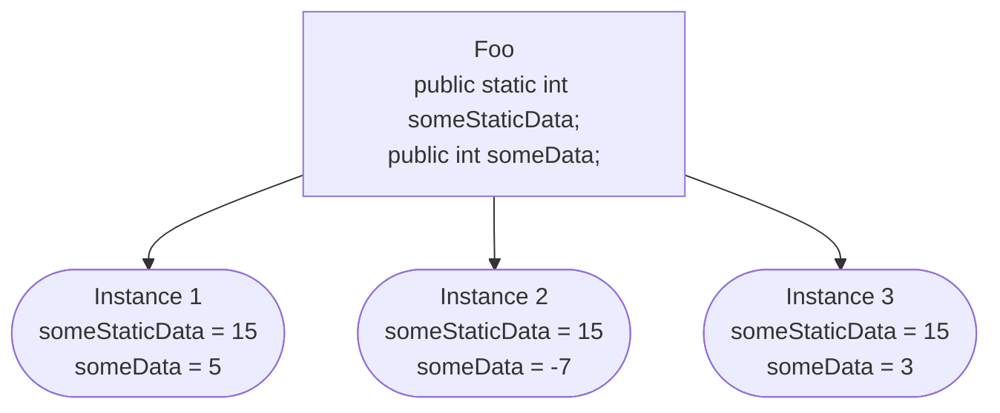

---
aliases:
  - static
  - static class
  - static method
  - static field
---
The `static` keyword can be difficult to understand because of its different meanings depending on the context it is used in. Overall, static is used to share data and combine behaviors between multiple instances of a class. This makes it possible to perform logic that would normally be managed outside of the class, keeping your code cleaner and more cohesive.

## At A Glance

The below table provides a short, memorable description of what static does when it is used in each valid context. Refer to this for quick reference, after reading the sections below to understand what static does in detail.

| Context         | Description                                                                                                                                                          |
| --------------- | -------------------------------------------------------------------------------------------------------------------------------------------------------------------- |
| Global Variable | Makes the variable 'static'. These variables are shared between all instances of a class, and do not store instance-specific information.                            |
| Method          | Methods that can only call other static methods and static variables. These must be invoked by calling the class instead of an instance of the class they belong to. |
| Class           | A class that can only contain static methods and static variables.                                                                                                   |

## Static Variables

Regular, non-static variables are responsible for maintaining the *state* of the instance of the class they are created in. This means that every time you create an object out of a class, you are creating another version of that variable to store data in.

Conversely, static variables do not maintain independent states between instances of a class. Instead, they have *shared states*. Each static variable has a single instance, which is shared among each instance of that class. Modifying the data in a static variable in any way will reflect the changes in each instance of that class.

Let's take a look at how that might happen. Consider the following blocks of code:

```cs
public class Foo {
	public int someData;
	public static int someStaticData;
	
	public Foo(int someData) {
		this.someData = someData;
	}
	
	public void SetSomeStaticData(int someStaticData) {
		this.someStaticData = someStaticData;
	}
	
	public override string ToString() {
		return $"someData: {someData}, someStaticData: {someStaticData}";
	}
}
```

```cs
var instance1 = new Foo(5);
var instance2 = new Foo(1);
var instance3 = new Foo(3);

Console.WriteLine(instance1);
Console.WriteLine(instance2);
Console.WriteLine(instance3);
```

When running the above code, we would expect results that look like the following:



Continuing from this example, let's try changing some values, by adding the two middle lines like in the block below.

```cs
var instance1 = new Foo(5);
var instance2 = new Foo(1);
var instance3 = new Foo(3);

instance2.someData = -7;
instance2.SetSomeStaticData(15);

Console.WriteLine(instance1);
Console.WriteLine(instance2);
Console.WriteLine(instance3);
```

In the results below, notice that the value of the `someStaticData` field has been updated in every instance of the class, but the non-static field `someData` only changed in the specific instance we called it on.



#### Accessing Static Fields Outside Of The Class

As you may have noticed, we needed to use the `SetSomeStaticData()` method to change the value of the `someStaticData` field. This is because a static variable can't be called using an instance of the class, like how non-static variable would normally be accessed. Instead, the variable must be called using the name of the class it's a part of.

To call someStaticData directly, we can access it using the `Foo` class:

```cs
Console.WriteLine(Foo.someStaticData);
//> 15
```

## Static Methods

Static methods are methods that can have limited interactions with the other elements of a class. They are restricted by the two characteristics below:

- Any global variables located in the same class that are called directly must be static
- Any methods located in the same class that are called directly must be static

#### Why Does This Matter?
Static methods are useful for specifying that a block of code *does not rely on instance-specific state*. This means that any logic that is purely reliant on its parameters to perform can be marked as such. This also allows any code that calls the static method to not require an instance to call said method, like in the below example:

```cs
public class Foo {
	public void DoAThing() {
		Console.WriteLine("I did a thing!");
	}
}
```

```cs
// this is what we need to do to call the method when it is not static
var foo = new Foo(); // we need to create an instance here but we never even use it
foo.DoAThing();

// assume we made DoAThing static here.
// this is what we'd need to do to call a static version of the method:
Foo.DoAThing();
// notice that this is much smaller, and we don't need to 
// create a whole variable to call a single method.
```

## Static Classes

Static classes are yet another level up from static methods. They are defined by the below behaviors:

- Static classes cannot have a constructor
- Static classes cannot have any instances created out of them
- All methods created in a static class must be static
- All global variables created in a static class must be static

Static classes are useful for grouping utility methods that don't need instance-specific information, for ease of use.